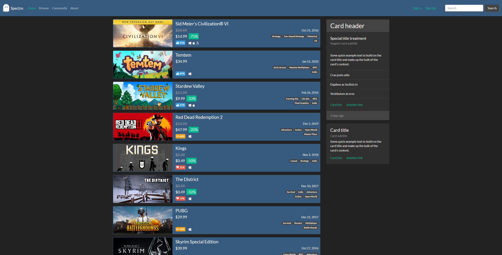

# CSC-301
Projects and Assignments from CSC-301 Web Programing

## Assignments
1. [Assignment-1](./asgmt-1 "asgmt-1") - Student Profile
2. [Assignment-2](./asgmt-2 "asgmt-2") - Index and Detail
3. [Assignment-3](./asgmt-3 "asgmt-3") - Data Storage
4. [Assignment-4](./asgmt-4 "asgmt-4") - Read/Modify/Delete Data
    - [Assignment-4-Bis](./asgmt-4-bis "asgmt-4-bis") - CSV/JSON Database Management System
5. [Assignment-5](./asgmt-5 "asgmt-5") - Login Management
6. [Assignment-6](./asgmt-6 "asgmt-6") - Static and Dynamic Classes
7. [Assignment-7](./asgmt-7 "asgmt-7") - Entity Relationship Model
8. [Assignment-8](./asgmt-6 "asgmt-8") - ER Database Implementation

## Spectre E-Game Store

An online game store that allows users to post reviews and publishers to add games.

---

~~SPectre ONline Games & Entertainment Shop~~